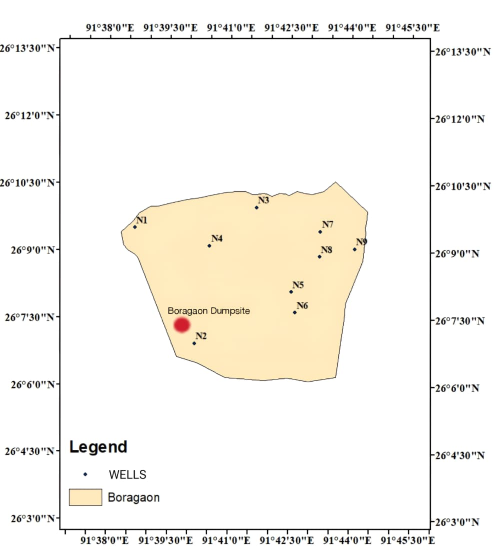
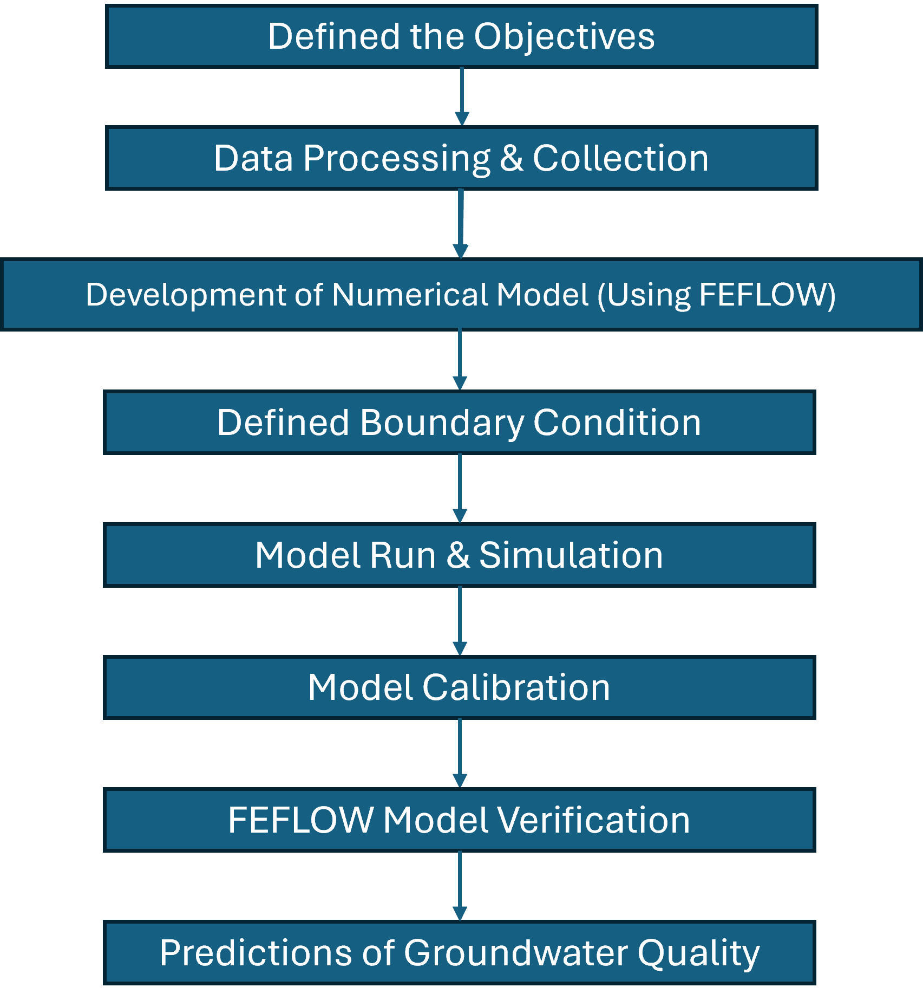
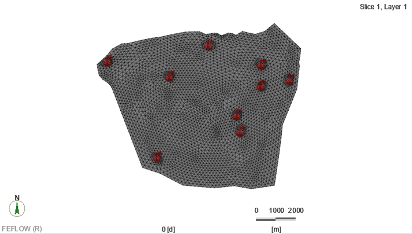
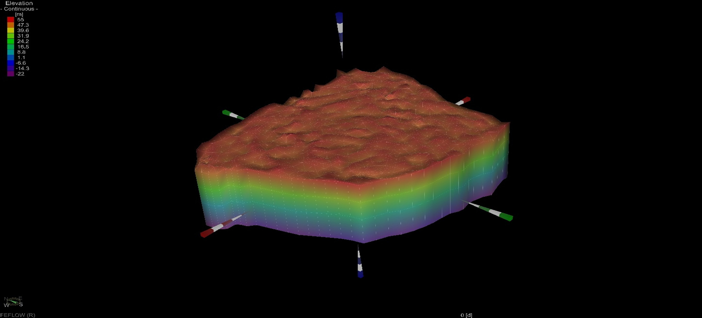
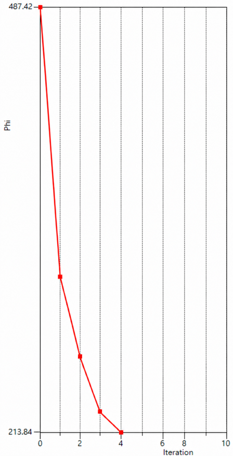
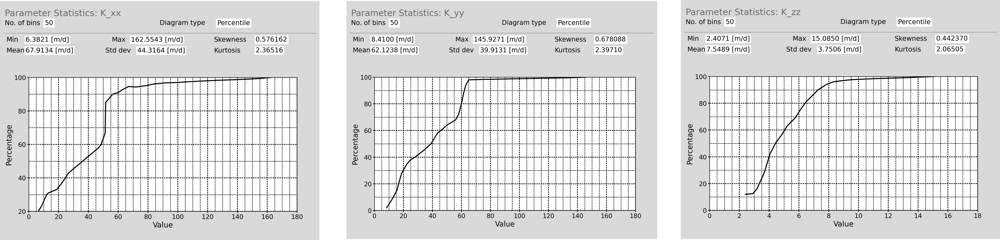
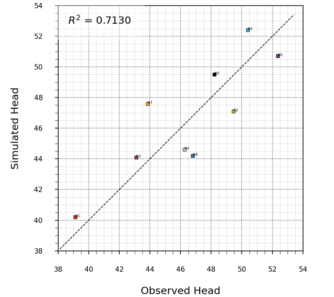
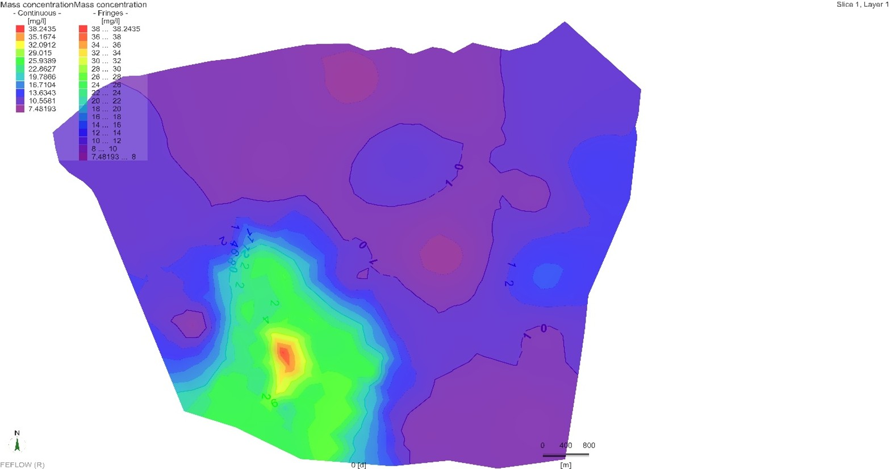
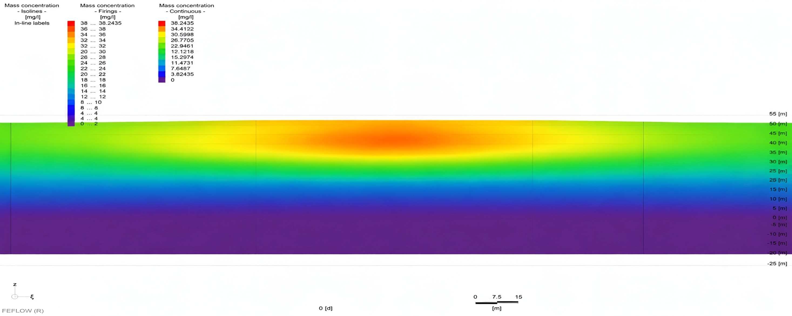

# Contaminant Transport Modelling in Groundwater Using FEFLOW

---

## 📌 Overview

This project presents the development of a three-dimensional groundwater flow and iron (Fe) contaminant transport model for the Boragaon dumpsite region in Guwahati, Assam, India.

The study uses **FEFLOW** finite-element groundwater modelling software to simulate groundwater flow, calibrate hydraulic parameters using **FEPEST**, and investigate the spatial and temporal migration of iron contamination within the shallow aquifer system.

The model integrates groundwater-level observations, aquifer characteristics, recharge, pumping rates, and contaminant concentration data to develop a numerical framework for understanding groundwater flow and contaminant transport.

---

## 🎯 Objectives

The major objectives of the study were:

* To develop a steady-state groundwater flow model for the Boragaon region using FEFLOW.
* To calibrate and validate simulated hydraulic heads against observed field data.
* To develop a transient groundwater flow model to understand the dynamic response of the aquifer.
* To simulate and analyse the migration of iron contamination within the shallow aquifer.
* To assess the groundwater contamination scenario across the study region.
* To identify major contamination hotspots and understand contaminant migration patterns.

---

## 📍 Study Area

The study focuses on the **Boragaon dumpsite region in Kamrup Metropolitan District, Assam**.

The Boragaon dumpsite is an unengineered municipal solid-waste disposal site. The study investigates the potential impact of leachate generated from the dumpsite on the underlying groundwater system.

The area was selected to investigate the movement and distribution of iron contamination within the shallow unconfined aquifer.

<p align="center">
  
</p>

---

## 🧰 Tools & Technologies

| Tool                | Application                                          |
| ------------------- | ---------------------------------------------------- |
| **FEFLOW**          | Groundwater flow and contaminant transport modelling |
| **FEPEST**          | Model calibration and parameter estimation           |
| **GIS**             | Spatial data processing and study-area analysis      |
| **Python**          | Data analysis and statistical processing             |
| **Microsoft Excel** | Data preparation and analysis                        |

---

## 📊 Data Used

The modelling study incorporated the following datasets:

* SRTM elevation data
* Groundwater-level observations
* Precipitation data
* Groundwater recharge data
* Pumping-rate data
* Aquifer hydraulic parameters
* Lithological and hydrogeological information
* Iron concentration observations

Groundwater-level and hydrogeological information were obtained from relevant **Central Ground Water Board (CGWB)** datasets.

---

## 🔬 Methodology

The overall modelling workflow consisted of the following stages:

```text
Study Area Identification
          ↓
Data Collection & Processing
          ↓
Conceptual Model Development
          ↓
Finite Element Mesh Generation
          ↓
3D Model Development
          ↓
Initial & Boundary Conditions
          ↓
Material Property Assignment
          ↓
Groundwater Flow Simulation
          ↓
FEPEST Calibration
          ↓
Steady-State & Transient Simulation
          ↓
Iron Contaminant Transport
          ↓
Results & Spatial Analysis
```

### Modelling Workflow

<p align="center">
  
</p>

---

## 🧮 Numerical Modelling

The groundwater flow model was developed using the **Finite Element Method (FEM)** implemented in FEFLOW.

The model domain was discretised into finite elements, with mesh refinement applied around wells and areas where groundwater hydraulic gradients and velocities could vary significantly.

A **three-dimensional model** was used because groundwater flow and contaminant transport can occur in both horizontal and vertical directions across different aquifer layers.

### Finite Element Mesh

<p align="center">
  
</p>

### 3D Model

<p align="center">
  
</p>

---

## ⚙️ Boundary Conditions

The model incorporated hydraulic-head and no-flow boundary conditions based on the hydrogeological characteristics of the study area.

The **Brahmaputra River** and wetland boundaries were represented using hydraulic-head boundary conditions.

Multilayer wells were used to represent groundwater extraction from multiple aquifer layers, with pumping rates assigned based on available data.

Recharge was applied to the upper model layer.

---

## 📈 Model Calibration

Model calibration was performed using **FEPEST**.

The objective of calibration was to reduce the difference between observed and simulated groundwater heads by adjusting model parameters within realistic hydrogeological bounds.

The objective function decreased from:

### **487.42 → 213.84**

<p align="center">
  
</p>

The calibrated model converged within the selected parameter bounds.

Multiple calibration runs with different initial hydraulic-conductivity conditions were performed to assess calibration stability.

---

## 💧 Hydraulic Conductivity

The calibrated hydraulic conductivity values were obtained in three principal directions:

| Parameter | Minimum (m/day) | Maximum (m/day) | Mean (m/day) |
| --------- | --------------: | --------------: | -----------: |
| **Kxx**   |          6.3821 |        162.5543 |      67.9134 |
| **Kyy**   |          8.4100 |        145.9271 |      62.1238 |
| **Kzz**   |          2.4071 |         15.0850 |       7.5489 |

<p align="center">
  
</p>

The results demonstrate spatial heterogeneity in hydraulic conductivity across the model domain.

---

## 📉 Hydraulic Head Calibration

The calibrated model reproduced the observed groundwater-head behaviour with reasonable agreement.

The reported steady-state calibration achieved:

### **R² = 0.7130**

<p align="center">
  
</p>

Transient simulations were also performed to reproduce seasonal groundwater-level variations.

The transient simulations reported R² values ranging from approximately **0.6477 to 0.8843**.

---

## ☣️ Iron Contaminant Transport

Iron transport was simulated using the **advection-dispersion formulation**.

The transport model considers the movement of dissolved iron through groundwater due to:

* Advection
* Hydrodynamic dispersion
* Groundwater velocity
* Solute concentration
* Porosity

### Iron Concentration Distribution

<p align="center">
  
</p>

The results identified the **Boragaon dumpsite and south-western region** as major iron contamination hotspots.

Simulated iron concentrations reached approximately:

### **35.16–38.24 mg/L**

The model also indicated significant vertical migration of iron contamination, reaching approximately **20–35 m depth**.

---

## 🌊 Groundwater Flow Simulation

<p align="center">
  
</p>

The flow simulation provides the groundwater flow-field framework required for analysing contaminant migration.

The contaminant transport behaviour is influenced by groundwater velocity, hydraulic conductivity and dispersive processes.

---

## 📌 Key Findings

* Developed a **3D groundwater flow model** for the Boragaon region using FEFLOW.
* Developed an **iron contaminant transport model** for the shallow aquifer.
* Calibrated the groundwater model using **FEPEST**.
* Reduced the calibration objective function from **487.42 to 213.84**.
* Achieved a reported steady-state calibration **R² of 0.7130**.
* Transient simulations reproduced seasonal groundwater-level variations with reported R² values ranging from **0.6477 to 0.8843**.
* Identified the **Boragaon dumpsite and south-western region** as major iron contamination hotspots.
* Simulated iron concentrations reaching approximately **35.16–38.24 mg/L**.
* Predicted vertical migration of iron contamination up to approximately **20–35 m depth**.
* Demonstrated the application of numerical groundwater modelling for contamination assessment and groundwater management.

---

## 🚀 Future Scope

Potential extensions of the study include:

* Integration of **Artificial Intelligence and Machine Learning** for automated parameter estimation and groundwater-quality prediction.
* Performing **sensitivity and uncertainty analysis** to improve model reliability.
* Development of coupled **surface-water and groundwater models** for the Deepor Beel–aquifer system.
* Assessment of **climate-change and land-use-change impacts** on groundwater recharge and contaminant migration.
* Calibration of additional transport parameters such as effective porosity, anisotropy and dispersivity.
* Incorporation of **reactive transport processes** into the modelling framework.

---

## 📂 Repository Structure

```text
contaminant-transport-modelling-feflow/
│
├── README.md
│
├── figures/
│   ├── study-area.png
│   ├── modelling-process.png
│   ├── 3d-model.png
│   ├── finite-element-mesh.png
│   ├── calibration.png
│   ├── conductivity-distribution.png
│   ├── hydraulic-head-calibration.png
│   ├── iron-concentration.png
│   └── flow-simulation.png
│
└── presentation/
    └── Contaminant_Transport_Modelling_FEFLOW.pptx
```

---

## 📊 Project Presentation

The complete project presentation is available in the repository:

**[View Project Presentation](presentation/Contaminant_Transport_Modelling_FEFLOW.pptx)**

---

## 👩‍💻 Author

### **Adarsh Tiwari**

**M.Tech — Water Resources Engineering and Management**
Department of Civil Engineering
**Indian Institute of Technology Guwahati**

### Project Supervisor

**Dr. Suresh A. Kartha**
Professor
Department of Civil Engineering
Indian Institute of Technology Guwahati

---

## 🎓 Academic Project

This project was carried out as an M.Tech thesis project at the **Department of Civil Engineering, Indian Institute of Technology Guwahati**.

The work focuses on numerical groundwater modelling and iron contaminant transport in the Boragaon region of Guwahati, Assam.

---

## ⚠️ Disclaimer

This repository is intended for academic and research purposes.

The model results are specific to the datasets, assumptions, boundary conditions and parameterisation used in the study. The results should therefore be interpreted within the context of the modelling framework and available field data.
